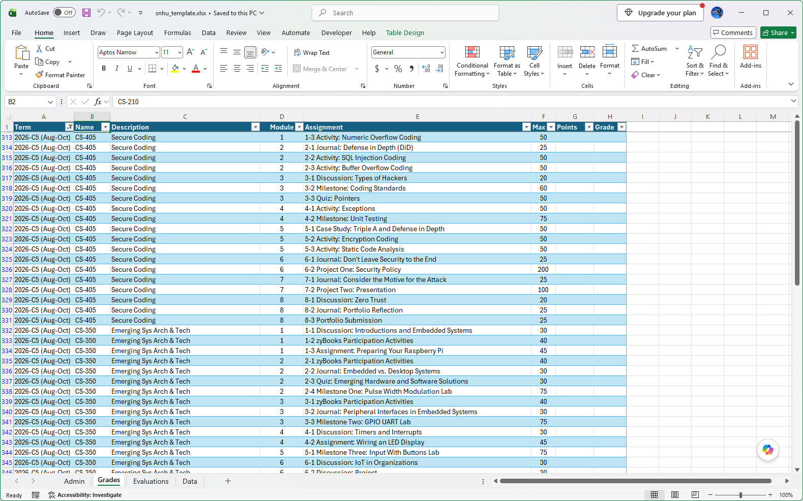

# SNHU Assignment Importer

SNHU Assignment Importer is a Windows utility that helps SNHU students keep track of their coursework by importing assignments directly from an SNHU Grades page into an Excel workbook.

I created this application because I wanted one place where I could see all of my assignments and make sure I did not fall behind or accidentally forget an assignment.

## Requirements

- Microsoft Windows
- Microsoft Excel or another application capable of opening `.xlsx` files
- Internet access
- An SNHU account

## Download

1. Download the latest Windows release from [Releases](https://github.com/TomArcher/snhu-assignment-importer/releases).
1. Extract the ZIP file to a directory of your choice.

## Getting Started

Before running the application, do the following:

1. Open the application's Excel workbook: `sn​​hu_template.xlsx`.
1. If Windows displays a Microsoft Defender SmartScreen warning:
    a. Select **More info**.
    b. Select **Run anyway**.
1. Select the **Data** tab.
1. Enter each course you want to track in the table. Note: The course name must match the course identifier used by SNHU (ex: `CS-350`).
1. (Optional) You can also enter the term, university, status, credits, description, instructor, instructor email, and notes.
1. Save and close the workbook.

## Importing Assignments

1. Run the application: `sn​​hu-assignment-importer.exe`
1. Follow the application instructions.

## Important

- Keep `snhu-assignment-importer.exe`, the `_internal` directory, and `snhu_template.xlsx` together in the same directory.

- Your spreadsheet and browser profile remain on your computer.

- The application does not require you to provide your SNHU username or password to the application itself. Authentication takes place through the SNHU website in the Chromium browser opened by the application.

## License

This project is licensed under the MIT License.